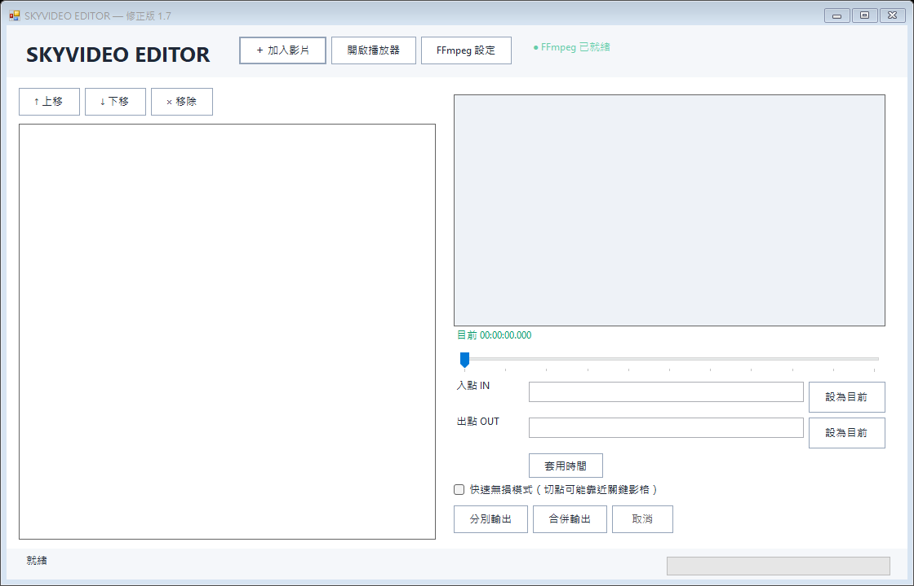

# SKYVIDEO EDITOR



完全離線的 Windows 桌面影片剪輯與合成工具。影片只在本機處理，不需要瀏覽器、localhost 或網路服務。

## 功能

- 一次加入多支影片，也可直接拖曳到程式視窗。
- 支援 MP4、MOV、MKV、WebM、AVI、M4V、WMV、FLV、MPEG、MPG、TS、MTS、M2TS。
- 逐筆預覽、拖曳排序、移除片段、設定起點／終點。
- 支援 Ctrl＋滑鼠左鍵選取不連續的多筆影片，以及 Shift 範圍選取。
- 清單有焦點時，Delete 移除所有選取項目；Ctrl+A 或「全選」按鈕選取全部。
- 「上移」「下移」或拖曳可一次搬移多筆選取項目，保留原本的相對順序。
- 「分別輸出」產生多個 MP4；「合併輸出」依清單順序產生一個 MP4。
- 批次讀取、剪輯與合成會顯示完成進度。

## 從原始碼建置

需要 Windows 內建的 .NET Framework C# 編譯器（通常隨 Windows 提供），不需要 NuGet。

```powershell
.\build_native.ps1
```

輸出檔案為 `dist\SKYVIDEO_EDITOR.exe`。也可以雙擊 `build_native.bat` 建置。

## 1.8 修正

- 「設為目前」按鈕依文字寬度自動調整，「套用時間」所在列依按鈕高度調整，避免裁切。
- 起點／終點標籤、時間欄位及控制列使用自動排版；最小面板寬度依 DPI 調整。
- 設定 End 或套用時間會保留目前預覽位置，不再跳回 Start；更新清單文字也保留多選和捲動位置。
- 支援鍵盤移除、多選、全選及批次排序；移除最後一筆會清空時間欄位和預覽。
- 讀取或輸出期間禁止移除、排序和變更時間，避免改動處理中的清單。

「移除」只移除程式清單項目，原始影片檔案會保留。多選用於移除和排序；右側 Start／End 編輯目前預覽的單一影片，輸出仍處理完整清單。

## 驗證

```powershell
.\test_native.ps1
# 也可加入真實影片與 FFmpeg 預覽測試：
.\test_native.ps1 -FfmpegPath 'D:\YourFolder\ffmpeg.exe'
```

測試涵蓋 End 位置保持、原生 Ctrl 點選、Delete／Ctrl+A、批次移除與排序，以及 100%、125%、150%、200% 的模擬縮放排版。測試影像和紀錄產生在 `work\`；模擬縮放不是跨螢幕 DPI 實測。

## FFmpeg

原始碼包不包含大型第三方 `ffmpeg.exe`。請從 [FFmpeg 官方網站](https://ffmpeg.org/download.html) 取得 Windows 版本，放到 EXE 同一資料夾，或在程式內按「FFmpeg 設定」選擇它。FFmpeg 依其自身授權條款發佈。

## 直接使用 Release

GitHub Release 同時提供單檔 `SKYVIDEO_EDITOR.exe`、含原始碼的 `SKYVIDEO_EDITOR-GitHub-Source-v1.8.zip`，以及內含 `ffmpeg.exe` 的 `SKYVIDEO_EDITOR-Portable-v1.8.zip`。下載 Portable ZIP 並完整解壓縮即可使用；也可把單檔 EXE 放入已有 `ffmpeg.exe` 的程式資料夾。Portable 版本含 Gyan.dev FFmpeg 7.1 GPLv3 建置，授權與對應來源資訊見壓縮檔內文件。

## 授權

本專案採 MIT License。FFmpeg 是獨立的第三方元件。
